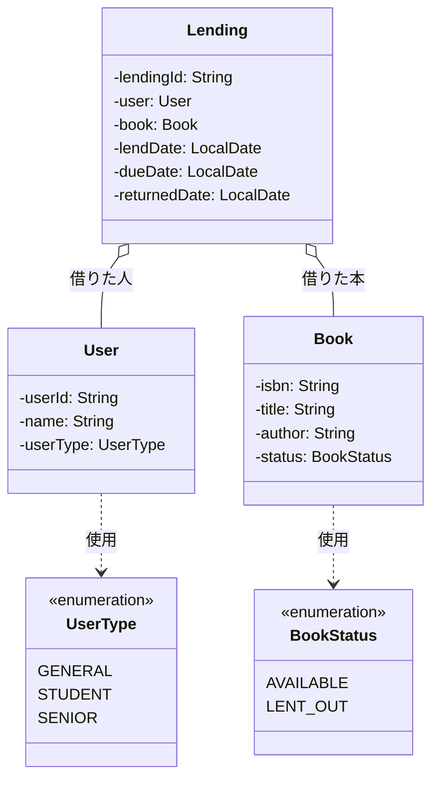

# 図書館蔵書管理システム 設計書

## 概要

本システムは、図書館の蔵書貸出業務をJavaで実装した学習用ポートフォリオである。
コマンドライン（CLI）から操作し、書籍の登録・利用者の登録・貸出・返却を管理する。

## クラス図

## クラスの責務

### Book（本）
- 蔵書1冊を表すクラス
- ISBN・タイトル・著者・現在の貸出状態を保持する

### User（利用者）
- 図書館の利用者1人を表すクラス
- 利用者ID・氏名・利用者区分を保持する

### Lending（貸出記録）
- 「誰が、どの本を、いつ借りて、いつ返したか」を記録するクラス
- UserとBookを集約関係で参照する
- 返却日（returnedDate）が null の場合は「貸出中」、値がある場合は「返却済み」と判定する

### BookStatus（列挙型）
- 本の貸出状態を表す
- AVAILABLE（貸出可能）/ LENT_OUT（貸出中）

### UserType（列挙型）
- 利用者の区分を表す
- GENERAL（一般）/ STUDENT（学生）/ SENIOR（高齢者）
- 区分により貸出可能冊数や貸出期間を変える設計とする

## 設計上の判断

### enumの採用
状態や区分のように「決まった値しか取らない」項目は、String型ではなくenum型で表現した。
理由：
- コードが自己説明的になる（`BookStatus.LENT_OUT` は意味が明確）
- タイポをコンパイル時に検出できる
- 状態が増えた場合の拡張に対応しやすい

### 派生情報を持たない設計
Lendingクラスでは、`returnedDate` の有無で「貸出中／返却済」を判定する。
別途 `status` フィールドを持つと、`returnedDate` との不整合が発生するリスクがあるため、
判定ロジックに統一した。

### 個人情報の最小化
Userクラスのフィールドは「ID・氏名・区分」の3つに絞った。
住所・電話番号・メールアドレス等は今回のシステムでは不要と判断。